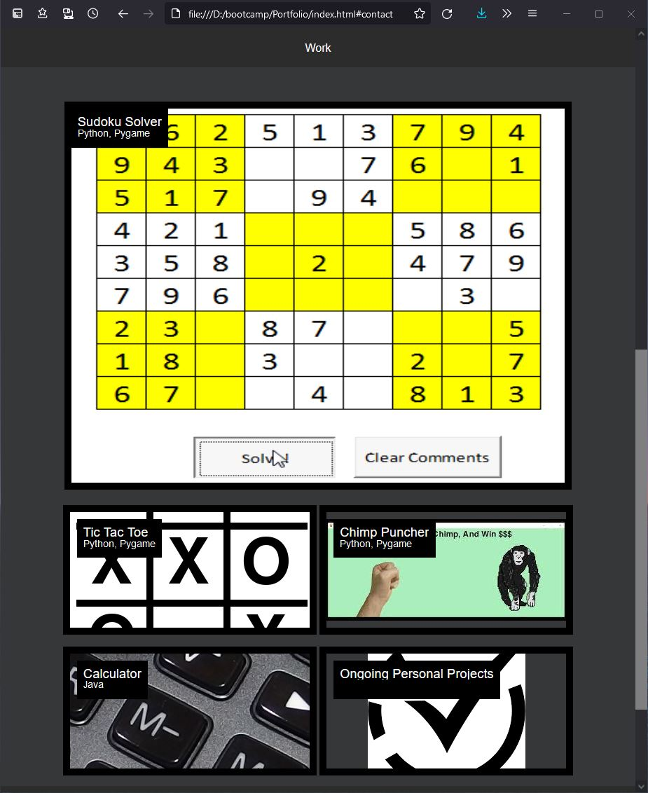
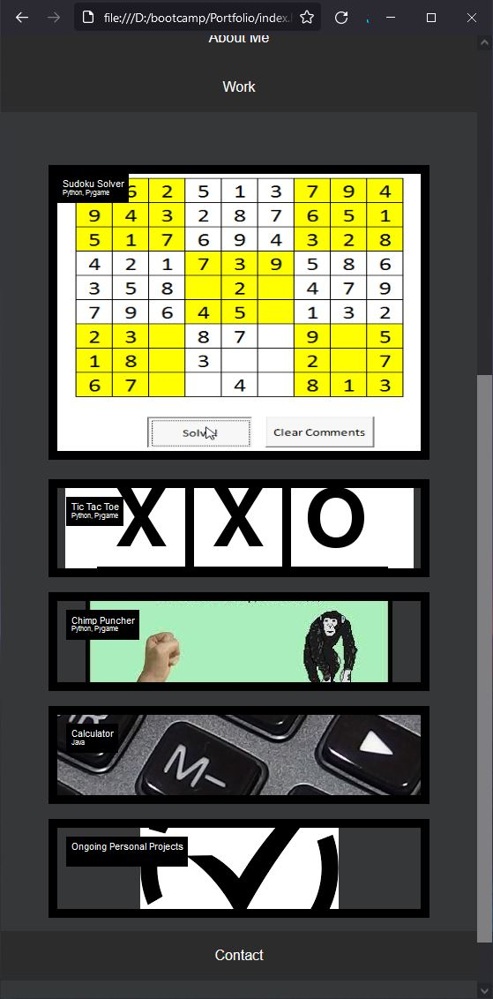
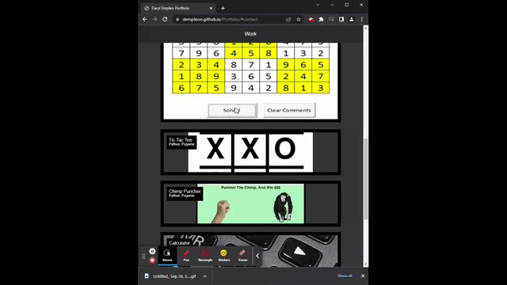

# Portfolio
This project is the first page of my Portfolio. As I continue with the bootcamp, I will continue to add more deatiails, as well as any necessary edits.

## Project Description
This webpage is my Portfolio. There are three sections which include an about me, a previous work section, and a contact section. When clicking on a link in the top nav bar, it scrolls down to the corresponding section. Each section header is a sticky at the top of the page. The work section content is flexible and resizes dynamically depending on the size. It showcases some computer programing projects that I have worked on in the past.

## Deployment
This webpage is deployed through github pages:
https://dempleon.github.io/Portfolio/

## Dev Notes
- The links to the shown work are just links to the repositories since they haven't been deployed.
- I will continue to work and add to it in the future
